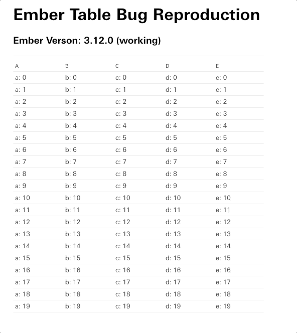

# ember-table-3-13-demo

A repro for a bug with ember v3.13 and ember-table.

Starting with Ember 3.13, the `endReorder` code takes a
very long time, and Ember/Ember-Table internally loses track of
the columns after the first reorder.

## Demo of Bug (Ember 3.13)

## Demo of Working Behavior (Ember 3.12)

Demo URL: https://et-3-12-no-bug.surge.sh

